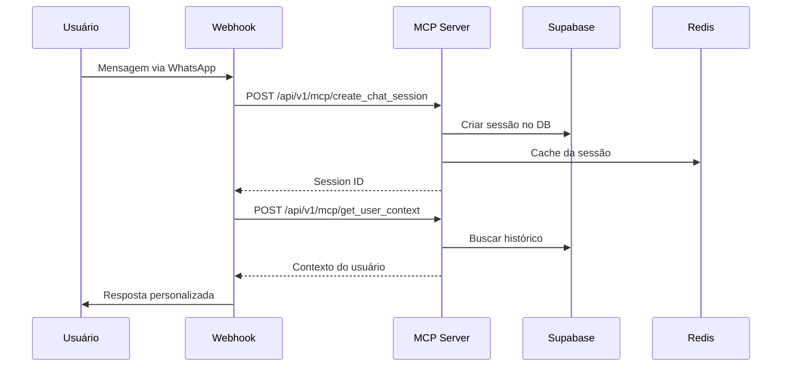
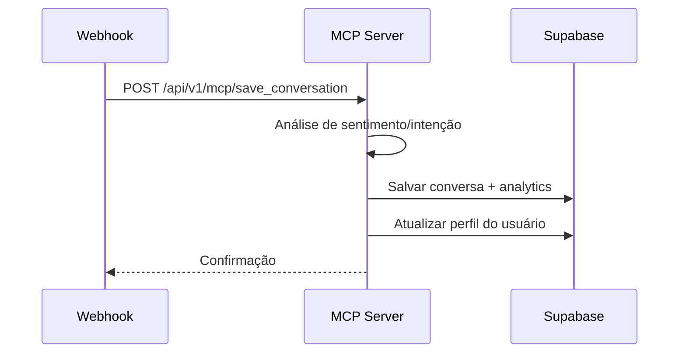

# TalkHub MCP Server

Servidor MCP (Model Context Protocol) integrado com Supabase, otimizado para chatbots conversacionais no TalkHub (whitelabel UCat).

## 🚀 Características

- **Integração Supabase**: Persistência de sessões, conversas e perfis de usuário
- **Análise Inteligente**: Análise de sentimento, intenção e contexto das conversas
- **Alta Disponibilidade**: Deploy com múltiplas réplicas e health checks
- **Cache Redis**: Sessões e contextos em cache para performance
- **API MCP Completa**: Ferramentas para criação e gerenciamento de sessões
- **Analytics Avançado**: Métricas e insights das conversas
- **Monitoramento**: Prometheus + Grafana para observabilidade
- **Segurança**: Rate limiting, CORS, autenticação JWT

## 🏗️ Arquitetura

```
┌─────────────────────────────────────────────────────────────┐
│                        TalkHub MCP Stack                    │
├─────────────────┬─────────────────┬─────────────────────────┤
│  MCP Server     │  Webhook Handler│      Dashboard          │
│  (API Core)     │  (Integrações)  │   (Monitoramento)       │
├─────────────────┼─────────────────┼─────────────────────────┤
│       Redis (Cache)              │    Supabase (Database)   │
├─────────────────────────────────────────────────────────────┤
│              Prometheus + Grafana (Monitoring)              │
└─────────────────────────────────────────────────────────────┘
```

## 📋 Pré-requisitos

- Docker Swarm inicializado
- Traefik configurado com rede `talkhub`
- Supabase rodando em `https://supatalk.talkhub.me`
- Acesso ao GitHub Container Registry (GHCR)
- Domínios configurados no DNS:
  - `mcp.talkhub.me` (API MCP)
  - `webhook.talkhub.me` (Webhooks)
  - `dashboard.talkhub.me` (Dashboard)
  - `monitoring.talkhub.me` (Grafana)

## ⚙️ Configuração

### 1. Clone e Configure

```bash
git clone <seu-repositorio>
cd talkhub-mcp-server
cp .env.example .env
```

### 2. Gerar Secrets

```bash
chmod +x deploy-talkhub.sh
./deploy-talkhub.sh secrets
```

### 3. Configurar .env

Edite o arquivo `.env` com os secrets gerados e suas configurações:

```bash
# Obrigatórios
GHCR_USER=seu_usuario_github
CR_PAT=seu_github_token
JWT_SECRET=secret_gerado
ADMIN_SECRET=secret_gerado
WEBHOOK_SECRET=secret_gerado

# Supabase (já configurado)
SUPABASE_URL=https://supatalk.talkhub.me
SUPABASE_ANON_KEY=sua_anon_key
```

### 4. Ajustar docker-stack.yml

Substitua `<SEU_USUARIO_GH>` pelo seu usuário GitHub no arquivo `docker-stack.yml`.

## 🚀 Deploy

### Deploy Completo (Recomendado)

```bash
# Deploy completo: Supabase + Build + Deploy
./deploy-talkhub.sh full
```

### Deploy Manual (Passo a Passo)

```bash
# 1. Inicializar Supabase
./deploy-talkhub.sh init-supabase

# 2. Build e push das imagens
./deploy-talkhub.sh build

# 3. Deploy da stack
./deploy-talkhub.sh deploy

# 4. Verificar status
./deploy-talkhub.sh status
```

## 🛠️ Ferramentas MCP Disponíveis

O servidor expõe as seguintes ferramentas MCP em `/api/v1/mcp/tools`:

### 1. `create_chat_session`
Cria uma nova sessão de chat para um usuário
```json
{
  "user_id": "string",
  "user_data": "object",
  "platform": "string"
}
```

### 2. `get_user_context`
Busca contexto histórico do usuário
```json
{
  "user_id": "string",
  "include_history": "boolean"
}
```

### 3. `save_conversation`
Salva conversa com análise de intenção
```json
{
  "session_id": "string",
  "user_id": "string",
  "messages": "array",
  "intent_analysis": "object"
}
```

### 4. `update_user_profile`
Atualiza perfil do usuário
```json
{
  "user_id": "string",
  "profile_data": "object"
}
```

### 5. `get_conversation_analytics`
Retorna analytics das conversas
```json
{
  "user_id": "string (opcional)",
  "date_range": "object",
  "metrics": "array"
}
```

## 📊 Monitoramento

### Verificar Status

```bash
./deploy-talkhub.sh status
```

### Visualizar Logs

```bash
# Logs do MCP Server
./deploy-talkhub.sh logs mcp

# Logs do Webhook Handler
./deploy-talkhub.sh logs webhook

# Logs de todos os serviços
./deploy-talkhub.sh logs all
```

### Health Checks

- **MCP Server**: `https://mcp.talkhub.me/api/health`
- **Webhook Handler**: `https://webhook.talkhub.me/health`
- **Dashboard**: `https://dashboard.talkhub.me`
- **Monitoramento**: `https://monitoring.talkhub.me`

### Grafana Dashboard

Acesse `https://monitoring.talkhub.me` com:
- **Usuário**: `admin`
- **Senha**: Valor de `GRAFANA_PASSWORD` no .env

## 🔌 Integração com TalkHub/UCat

### Configurar no TalkHub

1. **Adicionar MCP Server**:
   - URL: `https://mcp.talkhub.me`
   - Autenticação: Bearer Token (gerar via `/api/v1/auth/token`)

2. **Configurar Webhook**:
   - URL: `https://webhook.talkhub.me/uchat`
   - Secret: Valor de `WEBHOOK_SECRET`

3. **Exemplo de Uso no Flow**:
```javascript
// No action block do TalkHub
{
  "integration": "mcp_server",
  "action": "create_chat_session",
  "parameters": {
    "user_id": "{{user_id}}",
    "user_data": {
      "name": "{{user_name}}",
      "phone": "{{user_phone}}"
    },
    "platform": "whatsapp"
  }
}
```

## 📈 Analytics e Insights

O sistema coleta automaticamente:

- **Métricas de Conversas**: Volume, duração, completion rate
- **Análise de Sentimento**: Positivo, negativo, neutro
- **Detecção de Intenção**: Suporte, compra, informação, reclamação
- **Padrões de Uso**: Horários de pico, tópicos frequentes
- **Performance**: Tempos de resposta, taxa de erro

### Visualizar Analytics

```bash
curl -H "Authorization: Bearer $TOKEN" \
     "https://mcp.talkhub.me/api/v1/mcp/get_conversation_analytics"
```

## 🔧 Operações

### Escalar Serviços

```bash
# Escalar MCP Server para 3 réplicas
./deploy-talkhub.sh scale talkhub-mcp-server 3

# Escalar Webhook Handler para 2 réplicas
./deploy-talkhub.sh scale talkhub-webhook 2
```

### Atualizar Aplicação

```bash
# 1. Fazer alterações no código
# 2. Build nova imagem
./deploy-talkhub.sh build

# 3. Atualizar serviço (rolling update)
docker service update --image ghcr.io/SEU_USUARIO/talkhub-mcp-server:latest talkhub-mcp_talkhub-mcp-server
```

### Backup dos Dados

```bash
# Backup automático via Supabase Dashboard ou CLI
supabase db dump --db-url="$DATABASE_URL" > backup_$(date +%Y%m%d).sql
```

## 🧹 Limpeza

### Remover Stack

```bash
./deploy-talkhub.sh cleanup
```

### Limpar Cache Redis

```bash
# Conectar ao Redis
docker exec -it $(docker ps -q -f name=talkhub-mcp_redis) redis-cli

# Limpar sessões expiradas
SCAN 0 MATCH session:* COUNT 1000
```

## 🔍 Troubleshooting

### Problemas Comuns

**1. Erro de conexão com Supabase**
```bash
# Verificar se o Supabase está rodando
curl https://supatalk.talkhub.me/rest/v1/

# Verificar logs
./deploy-talkhub.sh logs mcp
```

**2. Webhook não recebe dados**
```bash
# Verificar logs do webhook
./deploy-talkhub.sh logs webhook

# Testar endpoint
curl -X POST https://webhook.talkhub.me/uchat \
     -H "Content-Type: application/json" \
     -d '{"test": true}'
```

**3. Dashboard não carrega**
```bash
# Verificar status do serviço
docker service ps talkhub-mcp_talkhub-dashboard

# Verificar logs
./deploy-talkhub.sh logs dashboard
```

### Logs Detalhados

```bash
# Logs em tempo real com filtros
docker service logs -f --tail 100 talkhub-mcp_talkhub-mcp-server | grep ERROR

# Logs estruturados no volume
docker exec -it $(docker ps -q -f name=talkhub-mcp_talkhub-mcp-server) tail -f /app/logs/app.log
```

### Performance

```bash
# Verificar uso de recursos
docker stats $(docker ps -q -f name=talkhub-mcp)

# Verificar conectividade entre serviços
docker exec -it $(docker ps -q -f name=talkhub-mcp_talkhub-mcp-server) ping redis
docker exec -it $(docker ps -q -f name=talkhub-mcp_talkhub-mcp-server) curl http://supatalk.talkhub.me/rest/v1/
```

## 🔐 Segurança

### Configurações de Segurança

- **JWT Tokens**: Expiração de 24h, rotação automática
- **Rate Limiting**: 1000 requests/15min por IP
- **CORS**: Configurado para domínios específicos
- **Headers de Segurança**: Helmet.js com CSP
- **Usuário não-root**: Containers rodando com usuário limitado
- **Secrets Management**: Variáveis de ambiente criptografadas

### Renovar Secrets

```bash
# Gerar novos secrets
./deploy-talkhub.sh secrets

# Atualizar .env e fazer redeploy
./deploy-talkhub.sh deploy
```

## 📡 API Reference

### Autenticação

```bash
# Gerar token de acesso
curl -X POST https://mcp.talkhub.me/api/v1/auth/token \
  -H "Content-Type: application/json" \
  -d '{
    "username": "admin",
    "admin_secret": "SEU_ADMIN_SECRET"
  }'
```

### Endpoints Principais

#### Health Check
```bash
GET https://mcp.talkhub.me/api/health
```

#### Listar Ferramentas MCP
```bash
GET https://mcp.talkhub.me/api/v1/mcp/tools
```

#### Criar Sessão de Chat
```bash
POST https://mcp.talkhub.me/api/v1/mcp/create_chat_session
Content-Type: application/json

{
  "user_id": "user_123",
  "user_data": {
    "name": "João Silva",
    "phone": "+5511999999999",
    "platform": "whatsapp"
  },
  "platform": "whatsapp"
}
```

#### Buscar Contexto do Usuário
```bash
GET https://mcp.talkhub.me/api/v1/mcp/get_user_context/user_123?include_history=true
```

#### Salvar Conversa
```bash
POST https://mcp.talkhub.me/api/v1/mcp/save_conversation
Content-Type: application/json

{
  "session_id": "session_xxx",
  "user_id": "user_123",
  "messages": [
    {
      "role": "user",
      "content": "Olá, preciso de ajuda",
      "timestamp": "2025-01-01T10:00:00Z"
    },
    {
      "role": "assistant", 
      "content": "Claro! Como posso ajudar?",
      "timestamp": "2025-01-01T10:00:05Z"
    }
  ],
  "intent_analysis": {
    "intent": "support",
    "sentiment": "neutral",
    "confidence": 0.85
  }
}
```

#### Analytics de Conversas
```bash
GET https://mcp.talkhub.me/api/v1/mcp/get_conversation_analytics?user_id=user_123

# Com filtros de data
GET https://mcp.talkhub.me/api/v1/mcp/get_conversation_analytics?date_range={"start":"2025-01-01","end":"2025-01-31"}
```

## 🌐 Integração com Plataformas

### WhatsApp Business API

```javascript
// Webhook handler para WhatsApp
{
  "webhook_url": "https://webhook.talkhub.me/whatsapp",
  "verify_token": "SEU_WEBHOOK_SECRET",
  "events": ["messages", "messaging_postbacks"]
}
```

### Telegram Bot

```javascript
// Configuração do bot Telegram
{
  "webhook_url": "https://webhook.talkhub.me/telegram",
  "secret_token": "SEU_WEBHOOK_SECRET"
}
```

### UCat/TalkHub Flow Builder

```javascript
// Action block no flow builder
{
  "type": "integration",
  "integration": "mcp_server",
  "endpoint": "https://mcp.talkhub.me",
  "tool": "get_user_context",
  "parameters": {
    "user_id": "{{contact.id}}",
    "include_history": true
  },
  "output_variable": "user_context"
}
```

## 📊 Estrutura do Banco (Supabase)

### Tabelas Principais

#### `chat_sessions`
```sql
- id (BIGSERIAL PRIMARY KEY)
- session_id (VARCHAR UNIQUE)
- user_id (VARCHAR)
- user_data (JSONB)
- platform (VARCHAR)
- status (VARCHAR)
- created_at (TIMESTAMP)
- updated_at (TIMESTAMP)
```

#### `conversations`
```sql
- id (BIGSERIAL PRIMARY KEY)
- conversation_id (VARCHAR UNIQUE)
- session_id (VARCHAR)
- user_id (VARCHAR)
- messages (JSONB)
- intent_analysis (JSONB)
- metadata (JSONB)
- created_at (TIMESTAMP)
```

#### `user_profiles`
```sql
- id (BIGSERIAL PRIMARY KEY)
- user_id (VARCHAR UNIQUE)
- name (VARCHAR)
- phone (VARCHAR)
- email (VARCHAR)
- preferences (JSONB)
- interaction_stats (JSONB)
- tags (TEXT[])
- created_at (TIMESTAMP)
```

## 🔄 Workflows Típicos

### 1. Nova Conversa



### 2. Finalização de Conversa



## 🚀 Roadmap

### v1.1 (Próxima Release)
- [ ] Integração com OpenAI para análise avançada
- [ ] Suporte a múltiplos idiomas
- [ ] Cache inteligente com TTL dinâmico
- [ ] Webhooks bidirecionais

### v1.2 (Futuro)
- [ ] Machine Learning para predição de intenções
- [ ] API GraphQL
- [ ] Integração com CRM externos
- [ ] Dashboard em tempo real

### v2.0 (Longo Prazo)
- [ ] Arquitetura de microserviços
- [ ] Suporte a WebRTC para chamadas
- [ ] IA para respostas automáticas
- [ ] Multi-tenancy

## 🤝 Contribuição

1. Fork do projeto
2. Criar branch para feature (`git checkout -b feature/nova-feature`)
3. Commit das mudanças (`git commit -am 'Add nova feature'`)
4. Push para branch (`git push origin feature/nova-feature`)
5. Criar Pull Request

## 📞 Suporte

Para problemas ou dúvidas:

1. **Verificar Status**: `./deploy-talkhub.sh status`
2. **Consultar Logs**: `./deploy-talkhub.sh logs all`
3. **Testar Health**: `curl https://mcp.talkhub.me/api/health`
4. **Consultar Documentação**: Este README
5. **Criar Issue**: No repositório GitHub

## 📝 Changelog

### v1.0.0 (Current)
- ✅ Servidor MCP completo com Supabase
- ✅ Integração com Redis para cache
- ✅ Analytics e insights das conversas
- ✅ Docker Swarm deployment
- ✅ Monitoramento com Prometheus/Grafana
- ✅ Webhooks para plataformas de chat
- ✅ Dashboard de administração

## 📄 Licença

MIT License - veja [LICENSE](LICENSE) para detalhes.

---

**TalkHub MCP Server** - Potencializando chatbots conversacionais com inteligência e contexto! 🤖💬